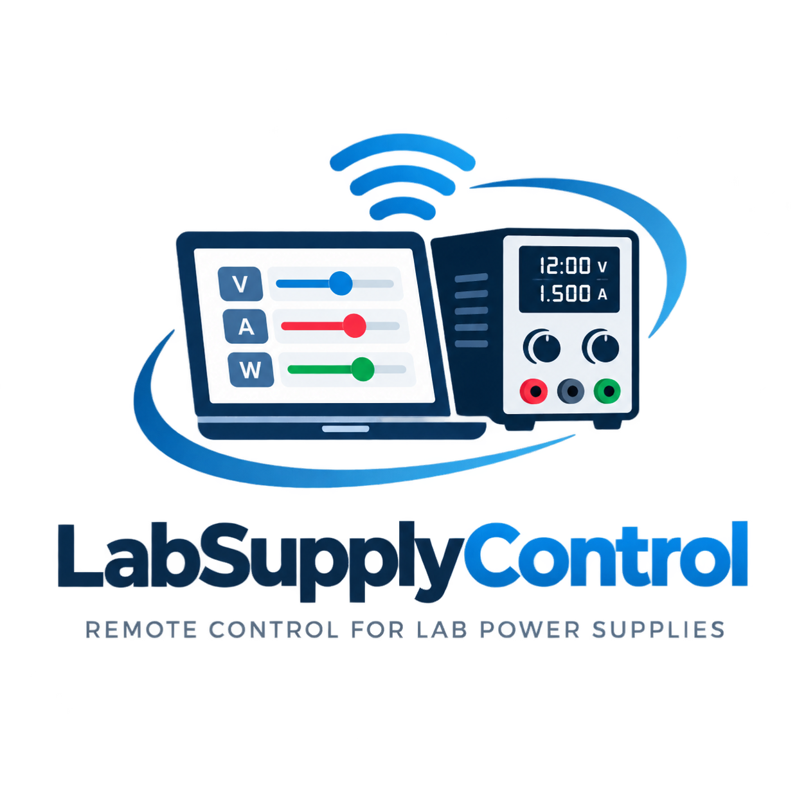

<p align="center">
  
</p>

# LabSupplyControl — User Manual

A guide to every part of the interface. For installation and a feature overview,
see the [README](README.md).

## Contents

1. [Getting started](#1-getting-started)
2. [Connecting](#2-connecting)
3. [The output readout](#3-the-output-readout)
4. [Power supply tab](#4-power-supply-tab)
5. [Live graph](#5-live-graph)
6. [Charger tab](#6-charger-tab)
7. [Sequence tab](#7-sequence-tab)
8. [Troubleshooting](#8-troubleshooting)

---

## 1. Getting started

Launch the app:

```bash
python3 app.py
```

The window has a shared **connection bar** and **output readout** at the top, a
set of **tabs** (Power supply / Charger / Sequence) for the controls, a **live
graph**, and a **status log** at the bottom.

By default the voltage/current limits match the SPS-D305-232 (30 V / 5 A). For a
different model, start with:

```bash
python3 app.py --max-voltage 60 --max-current 5
```

## 2. Connecting

1. **Pick the port.** The dropdown lists likely supplies, matched by their
   USB-serial bridge chip (CP2102/CP210x). Tick **Show all ports** if your
   adapter uses a generic name.
2. **Connect.** Click **Connect** (or if exactly one device is found at launch,
   the app connects automatically). On connect the supply is switched to
   **remote** mode, which locks its front-panel buttons.
3. **Disconnect** returns the supply to **local** mode (front panel active) and
   turns the output off.

> The address is always `000` for this protocol — there is nothing to configure.

## 3. The output readout

The black **OUTPUT** panel is always visible:

- **Actual** (large figures) — the live measured Volts / Amps / Watts.
- **Set** — the set-points last applied from the app (the protocol can't read
  these back, so they reflect what LabSupplyControl last sent).
- **CV / CC badge** — Constant Voltage (blue) or Constant Current (green) while
  the output is on; it turns red if the over-current trip fires.

## 4. Power supply tab

### Set-points
- Enter **Voltage** and **Current**, then click **Apply V & A** to send them.
- **Tap a value** to open a touch-friendly numeric keypad (range-checked). The
  up/down arrows still work for fine adjustment.

### Presets
- The dropdown lists saved V/A presets; selecting one loads it into the
  set-points. **Apply** loads *and* sends it.
- **Save…** stores the current set-points under a name; **Delete** removes the
  selected preset. Presets live in `presets.json`.
- If a preset would **raise** the voltage while the output is live, you get a
  one-time-dismissable warning (choose *Don't show again* to silence it).

### Output control
- **OUTPUT ON / OFF** toggles the output (green when on, red when off).
- **Power off on overcurrent** — when ticked, the output shuts off like a fuse
  if the supply reaches the set current (goes into current-limiting). The log
  records `Output shut off after hh:mm:ss due to overcurrent`.

## 5. Live graph

Plots **voltage** (left axis) and **current** (right axis) against elapsed time.

- **Window** — how much history to show (30 s … 10 min, or All).
- **Voltage / Current** checkboxes — show or hide each curve.
- **Pause logging** — stop/resume appending samples.
- **Clear** — empty the buffer.
- **Export CSV…** — save the whole log (timestamp, elapsed, V, A, W, mode).

The graph only records **while the output is on**.

## 6. Charger tab

Managed CC-CV charging from a chemistry template.

1. Pick a **Battery** chemistry (Lead-acid / Li-ion / LiFePO4).
2. Set the **Cells** and **Capacity**; adjust the **Rate** (C) if needed.
3. The summary shows the computed target voltage, charge current, and cutoff.
4. **Start charge** → confirm → the app sets CC/CV, turns the output on, and
   watches the current taper:
   - **Li-ion / LiFePO4** stop (output off) at ~C/10 → *Done ✓*.
   - **Lead-acid** drops to **float** voltage and holds it.
5. **Stop charge** ends it at any time.

> ⚠️ **Safety.** No cell balancing, no temperature sensing. Multi-cell lithium
> needs a BMS/balancer — Li chemistries default to 1 cell and warn before you
> raise it. Always supervise charging. See [Safety](README.md#safety).

## 7. Sequence tab

Run a CSV of timed actions on a timeline (elapsed from the start).

### CSV format

```
time,output,voltage,current
00:00:00,on,5.0,1.0
00:00:30,off
00:01:00,on,3.3,0.5
00:02:00,on,12.0,2.0
00:02:30,off
```

- **time** — `HH:MM:SS`, `MM:SS`, or plain seconds, elapsed from the start.
- **output** — `on` / `off`.
- **voltage**, **current** — optional; blank keeps the current set-point.
- A header row is optional; blank lines and `#` comments are ignored.

### Running

1. **Load CSV…** and review the parsed steps in the list.
2. **Run** executes each step at its time; the active step is highlighted and the
   status shows progress and the countdown to the next step.
3. At the end the sequence stops and the output is turned off.

While a sequence runs, the manual and charger controls are locked, and the
over-current trip still applies. See `example-sequence.csv`.

## 8. Troubleshooting

**The front panel is locked / shows "SET".** The supply is in remote mode
(normal while connected). **Disconnect** in the app to release it, or
**power-cycle** the supply — it boots in local mode.

**No device in the port list.** Tick **Show all ports**. Confirm the adapter
enumerates (`ls /dev/ttyUSB*` on Linux) and that you have permission (add
yourself to the `dialout` group).

**Connect fails / no readings.** Verify the cable and that nothing else holds
the port open. Run `python3 diagnose.py` to see the raw replies.

**The graph is empty.** It only logs while the output is on.

**A charge or sequence won't start.** You must be connected, and a charge
pack/step must fit within the supply's voltage/current limits.
