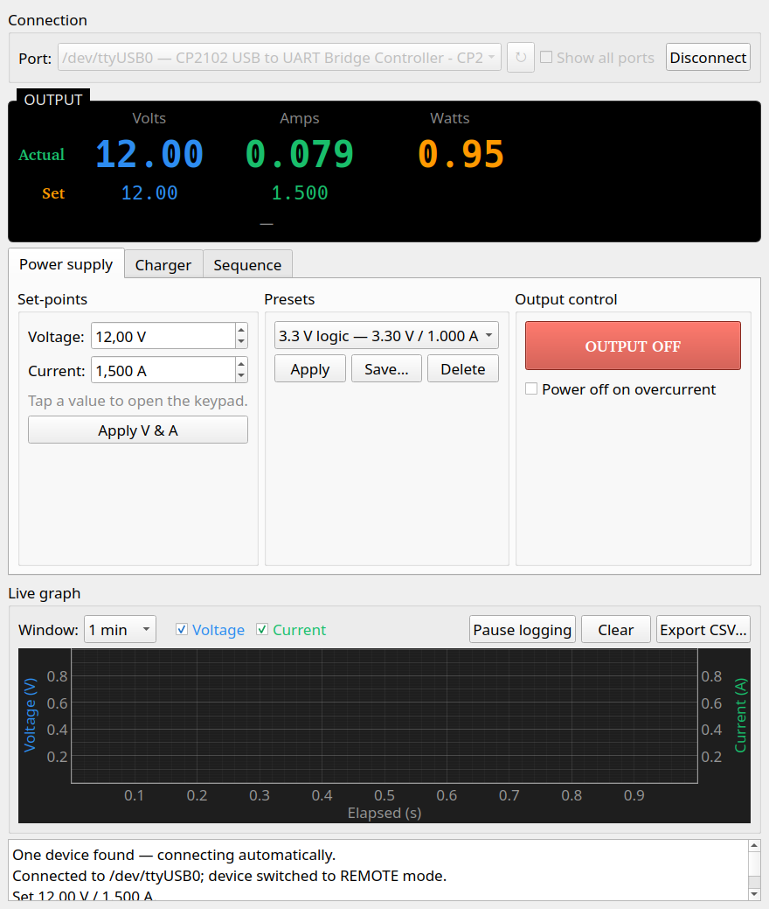

<p align="center">
  
</p>

<h1 align="center">LabSupplyControl</h1>

<p align="center">
  Remote control for Nice-Power / KUAIQU bench DC power supplies — a clean PyQt5
  desktop panel with live graphing, presets, battery-charge templates, and timed
  sequences.
</p>

<p align="center">
  
  
  
  
</p>

> **Status: early beta.** It works for everyday use, but it's only been tested
> against one model and there will be rough edges. Bug reports, fixes, and notes
> on which supplies it works with are very welcome.

<p align="center">
  
</p>

> **These supplies are not Modbus.** Despite the "-232" naming and the Modbus
> manuals floating around, this family speaks a simple **ASCII bracket protocol**
> (`<CCDDDDDDAAA>`). LabSupplyControl implements that protocol directly — see
> [Protocol](#protocol).

## Features

- **Auto-detect & connect** — finds the supply by its USB-serial bridge
  (CP2102/CP210x); if exactly one device is present it connects on launch.
- **Instrument-style readout** — live Volts / Amps / Watts, the applied
  set-points, and CV/CC mode.
- **Set-points with an on-screen keypad** — tap a value to type it directly
  (range-checked); the spin arrows still work for fine steps.
- **V/A presets** — save, load, and apply named voltage/current presets
  (persisted under `~/.config/labsupplycontrol/`); an optional warning before
  raising the voltage on a live output. The last set-points are restored on
  startup.
- **Live graph** — voltage & current vs. time (dual axis), with a selectable
  window, per-curve toggles, pause, clear, and **CSV export**. Logs only while
  the output is on.
- **Over-current trip** — optionally power off (like a fuse) when the supply
  reaches its set current limit.
- **Battery-charge templates** — lead-acid / Li-ion / LiFePO4 CC-CV charging
  with automatic taper termination or float. **Supervised use only — see
  [Safety](#safety).**
- **Timed sequences** — run a CSV of timed steps (set V/A, output on/off) on a
  timeline, with the active step highlighted.

See the **[User manual](MANUAL.md)** for a full walkthrough.

## Supported hardware

Built and tested against the **KUAIQU SPS-D305-232 / SPPS-D305-232** (30 V / 5 A,
single channel, RS-232 over a USB-serial adapter). It should work with other
Nice-Power / KUAIQU supplies that use the same ASCII protocol; pass
`--max-voltage` / `--max-current` for a different rating.

## Installation

Requires **Python 3.10+**, `pyserial`, and `PyQt5`. The live graph additionally
needs `pyqtgraph` and `numpy` (the rest of the app runs without them).

```bash
pip install -r requirements.txt
# On Debian/Ubuntu you can use the system packages instead:
sudo apt install python3-pyqt5 python3-pyqtgraph python3-numpy python3-serial
```

On Linux your user needs access to the serial port. If you get a permission
error on `/dev/ttyUSB0`, add yourself to the `dialout` group:

```bash
sudo usermod -aG dialout "$USER"   # then log out and back in
```

### Desktop integration (optional)

Add a menu entry and icon for KDE / GNOME (or any freedesktop desktop). This is
a user-level install — no root needed:

```bash
./install.sh      # adds the launcher + icon; re-run to update
./uninstall.sh    # removes them
```

LabSupplyControl then appears in your application launcher with its icon, and
the correct icon shows in the Wayland/X11 taskbar. (This only sets up the
launcher; install the Python dependencies above separately.)

## Usage

```bash
python3 app.py                               # defaults: 30 V / 5 A limits
python3 app.py --max-voltage 60 --max-current 5
```

Plug in the supply and pick its port (a USB-serial adapter shows up as
`/dev/ttyUSB0`, `/dev/ttyACM0`, or `COMx` on Windows). If only one device is
found, LabSupplyControl connects automatically. The controls are split into
three tabs — **Power supply**, **Charger**, and **Sequence** — with the
connection, live readout, and graph shared across all of them.

`diagnose.py` is a standalone script that sends the ASCII read commands and
prints the raw replies — handy for confirming the link outside the GUI.

## Safety

Battery charging drives real current into a cell — treat it with respect:

- This is **not** a substitute for a proper charger. There is **no cell
  balancing** and **no temperature sensing**.
- **Multi-cell lithium packs require a BMS / balance board.** Li-ion/LiFePO4
  default to 1 cell and warn before you select more.
- **Always supervise charging.** Use the over-current trip as a backstop.

LabSupplyControl refuses a pack whose target voltage/current exceeds the
supply's limits and asks for confirmation before starting a charge.

## Protocol

9600 baud, 8 data bits, no parity, 1 stop bit. Each frame is fixed length:

```
< CC DDDDDD AAA >
  │  │      └── 3-digit device address (send 000; the device echoes its own)
  │  └───────── 6-digit value = volts/amps × 1000, zero-padded
  └──────────── 2-char command code
```

| Action | PC sends | Device replies |
|---|---|---|
| Connect / enter remote | `<09100000000>` | `<19OK0000AAA>` |
| Disconnect / local | `<09200000000>` | — |
| Set voltage 4.58 V | `<01004580000>` | `<11OK0000AAA>` |
| Set current 6.92 A | `<03006920000>` | `<13OK0000AAA>` |
| Read voltage | `<02000000000>` | `<12VVVVVVAAA>` → V = VVVVVV/1000 |
| Read current | `<04000000000>` | `<14AAAAAAAAA>` (CV) / `<C4AAAAAAAAA>` (CC) |
| Output ON | `<07000000000>` | — |
| Output OFF | `<08000000000>` | — |

No checksum. Confirmed against the
[PowerLinkESP](https://github.com/dobrishinov/PowerLinkESP) firmware and the
vendor's *Serial-port-communication-protocol VER 02* document.

## Project layout

| Path | Purpose |
|------|---------|
| `app.py`              | PyQt5 control panel |
| `kuaiqu/protocol.py`  | ASCII frame builders and reply parsers |
| `kuaiqu/psu.py`       | `KuaiquPSU` driver + serial-port discovery |
| `charging.py`         | Battery chemistry profiles + CC-CV charge state machine |
| `sequence.py`         | CSV timed-sequence parser |
| `diagnose.py`         | Standalone serial-reply diagnostic |
| `test_protocol.py`    | Unit tests (no hardware needed) |
| `example-sequence.csv`| Example timed sequence |
| `install.sh` / `uninstall.sh` | Desktop-integration installer (KDE/GNOME) |
| `assets/`             | Logo, icon, and screenshot |

## Development

Everything hardware-independent is unit-tested (framing, parsing, charge state
machine, sequence parsing):

```bash
python3 test_protocol.py
```

Contributions welcome — please keep changes focused, match the existing style,
and make sure the tests pass.

## Acknowledgements

- [PowerLinkESP](https://github.com/dobrishinov/PowerLinkESP) by dobrishinov —
  a working ESP8266 implementation that confirmed the serial protocol.

## License

[MIT](LICENSE) © Jarl Gjessing

---

<sub>
<b>Keywords:</b> KUAIQU / Nice-Power bench power supply PC control software ·
SPS-D305-232 · SPPS-D305-232 · SPS-W3010 · SPS-3010 · programmable DC power
supply · USB / RS-232 serial control · remote control · data logging · battery
charger (lead-acid, Li-ion, LiFePO4) · CC-CV · CP2102 · Linux · PyQt5. These
supplies use a plain ASCII serial protocol — <i>not</i> Modbus.
</sub>
